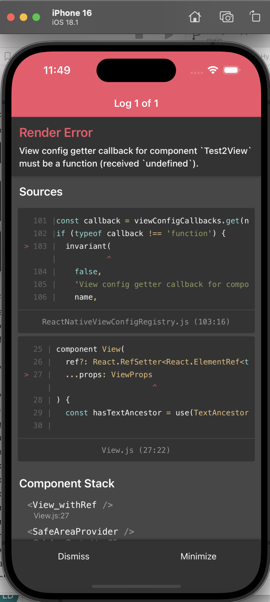

A (failing) simple app to test a [react native nitro module](https://nitro.margelo.com/) and based on its [youtube tutorial](https://www.youtube.com/watch?v=528SxTGnIlc)

# Architecture

## simple-lib

A react native library created with Nitrogen with : 
* [Test1.nitro.ts](./simple-lib/src/specs/Test1.nitro.ts) : definition of a simple hybrid object implemented in Swift and Kotlin
* [Test2.nitro.ts](./simple-lib/src/specs/Test2.nitro.ts) : definition of a simple hybrid view implemented in Swift and Kotlin

## SimpleApp

A react native app created with @react-native-community/cli using simple-lib and react-native-modules

# Output

Using Test1 hybrid object in ios and android works !

Using Test2 hybrid view fails in ios and in android with the following log : 
```
{ [Invariant Violation: View config getter callback for component `Test2View` must be a function (received `undefined`).]
  name: 'Invariant Violation',
  framesToPop: 1,
  componentStack: '\n    at Test2View (<anonymous>)\n    at RCTView (<anonymous>)\n    at View_withRef (http://localhost:8081/index.bundle//&platform=ios&dev=true&lazy=true&minify=false&inlineSourceMap=false&modulesOnly=false&runModule=true&excludeSource=true&sourcePaths=url-server&app=org.reactjs.native.example.SimpleApp:5529:75)\n    at AppContent (<anonymous>)\n    at RNCSafeAreaProvider (<anonymous>)\n    at SafeAreaProvider (http://localhost:8081/index.bundle//&platform=ios&dev=true&lazy=true&minify=false&inlineSourceMap=false&modulesOnly=false&runModule=true&excludeSource=true&sourcePaths=url-server&app=org.reactjs.native.example.SimpleApp:97853:24)\n    at App (http://localhost:8081/index.bundle//&platform=ios&dev=true&lazy=true&minify=false&inlineSourceMap=false&modulesOnly=false&runModule=true&excludeSource=true&sourcePaths=url-server&app=org.reactjs.native.example.SimpleApp:97739:54)\n    at RCTView (<anonymous>)\n    at View_withRef (http://localhost:8081/index.bundle//&platform=ios&dev=true&lazy=true&minify=false&inlineSourceMap=false&modulesOnly=false&runModule=true&excludeSource=true&sourcePaths=url-server&app=org.reactjs.native.example.SimpleApp:5529:75)\n    at RCTView (<anonymous>)\n    at View_withRef (http://localhost:8081/index.bundle//&platform=ios&dev=true&lazy=true&minify=false&inlineSourceMap=false&modulesOnly=false&runModule=true&excludeSource=true&sourcePaths=url-server&app=org.reactjs.native.example.SimpleApp:5529:75)\n    at AppContainer (http://localhost:8081/index.bundle//&platform=ios&dev=true&lazy=true&minify=false&inlineSourceMap=false&modulesOnly=false&runModule=true&excludeSource=true&sourcePaths=url-server&app=org.reactjs.native.example.SimpleApp:51633:25)\n    at SimpleApp(RootComponent) (http://localhost:8081/index.bundle//&platform=ios&dev=true&lazy=true&minify=false&inlineSourceMap=false&modulesOnly=false&runModule=true&excludeSource=true&sourcePaths=url-server&app=org.reactjs.native.example.SimpleApp:68127:28)',
  isComponentError: true }, { [Stack] name: 'Stack' }

```

